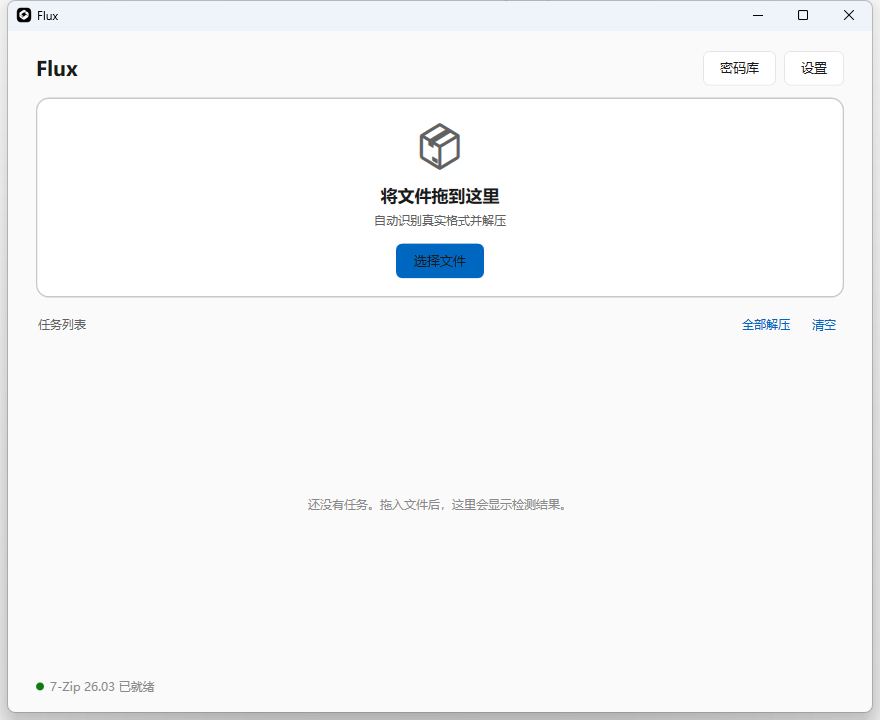
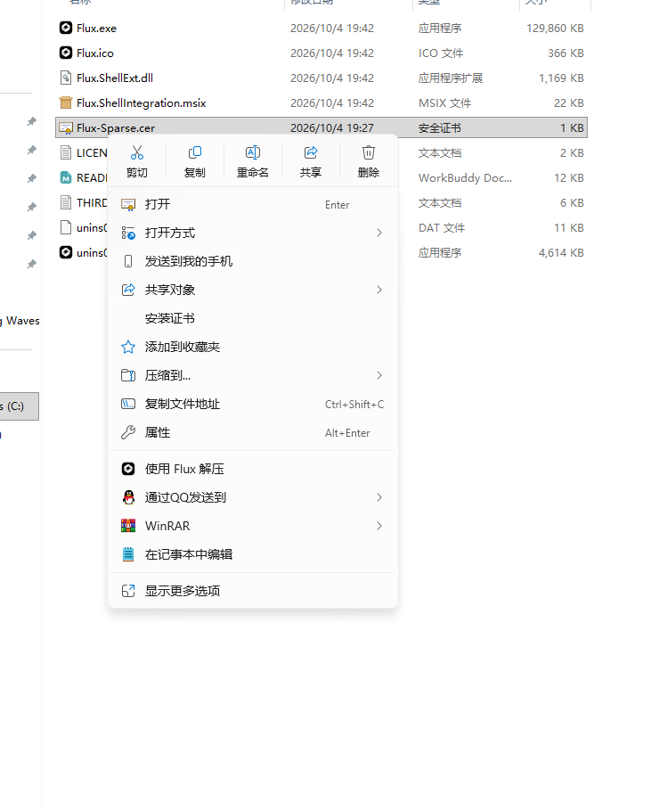
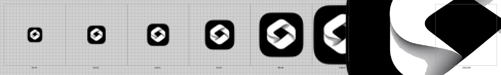

<div align="center">
  
  <h1>Flux</h1>
  <p><b>拖进来就解压的智能解压工具，支持 Windows 11 一级右键菜单</b></p>
</div>

<div align="center">

[](https://learn.microsoft.com/zh-cn/windows/)
[](https://dotnet.microsoft.com/)
[](LICENSE)

</div>

---

## ⬇️ 下载

**最新版本：[v1.0.0](https://github.com/him803506-ctrl/Flux/releases/latest)**

| 文件 | 大小 | 说明 |
|---|---|---|
| **[`Flux_Setup-1.0.0.exe`](https://github.com/him803506-ctrl/Flux/releases/download/v1.0.0/Flux_Setup-1.0.0.exe)** | 42.9 MB | **推荐**。安装版，自动导入证书、注册一级右键菜单、创建桌面快捷方式 |
| [`Flux-1.0.0-portable.zip`](https://github.com/him803506-ctrl/Flux/releases/download/v1.0.0/Flux-1.0.0-portable.zip) | 54.4 MB | 绿色版，解压即用；右键菜单需管理员执行 `Flux.exe --register-shell` |
| [`SHA256SUMS.txt`](https://github.com/him803506-ctrl/Flux/releases/download/v1.0.0/SHA256SUMS.txt) | — | 校验和 |

> ⚠️ **运行前必须先装 [7-Zip](https://www.7-zip.org/)（≥ 21.07）** —— 它是解压引擎。
> .NET 运行时**无需另装**，已内置。

<details>
<summary>安装步骤</summary>

1. 下载 `Flux_Setup-1.0.0.exe`，双击安装（需要管理员权限）
2. 桌面上会出现名为 **Flux** 的快捷方式
3. 完事 —— 安装程序已自动完成：
   - 把自签证书导入「受信任的人」（`LocalMachine\TrustedPeople`）
   - 注册稀疏包，使「使用 Flux 解压」出现在**一级右键菜单**
   - 创建桌面与开始菜单快捷方式

**装完右键菜单没出现？** 在任务管理器里重启「Windows 资源管理器」，
或注销后重新登录 —— shell 会缓存扩展注册表。

</details>

<details>
<summary>绿色版步骤</summary>

1. 解压到任意目录
2. 右键菜单需**手动注册**：以管理员身份打开 PowerShell
   ```powershell
   cd <解压目录>
   .\Flux.exe --register-shell
   ```
3. 卸载菜单：同样管理员执行 `.\Flux.exe --unregister-shell`

</details>

---

## 这是什么

把压缩包拖进来就解压。**不认扩展名，只认文件头** ——
`游戏资源.mp4` 其实是 ZIP 包的，它照样给你解开。

<p align="center">
  
</p>

拖入 → 自动识别真实格式 → 自动匹配密码库 → 解压。就这三步。

更多功能见 **[使用说明](docs/使用说明.md)**。

## 特性

| | |
|---|---|
| **真实格式识别** | 读文件头魔数判定，包括**尾部附加**的压缩包（网盘绕审核的常见手法） |
| **伪装检测** | 扩展名是视频、内容是压缩包，会明确提示而不是默默跳过 |
| **真视频保护** | 确认真视频则完全不动，不解压、不改名 |
| **密码库** | 任意数量条目，DPAPI 加密存储；遇到加密包自动遍历匹配 |
| **批量处理** | 一次拖多个，单个失败不影响整批 |
| **实时进度 + 取消** | 已处理/总字节，随时可中断 |
| **安全解压** | Zip Slip / Path Traversal 防护，恶意路径直接拦截 |
| **一级右键菜单** | 右键直接可见「使用 Flux 解压」，不用点「显示更多选项」 |
| **完全本地** | 不联网、不上传文件、不上传密码 |

## 一级右键菜单

<p align="center">
  
</p>

这是本项目技术含量最高、也最难做出来的部分。

Windows 11 的紧凑右键菜单**只接受有包标识（Package Identity）的应用**，
传统注册表方式一定会被折叠进二级菜单。所以要进一级菜单，
必须给传统 Win32 程序套一个**稀疏包**（Sparse Package），
用 `IExplorerCommand` 接口实现菜单项，再由 `dllhost.exe` 跨进程加载。

<p align="center">
  
</p>

图标为多尺寸 ICO（16/20/24/32/48/64/128/256），
圆角方形外围是**真正的 Alpha 透明**，在浅色壁纸上也不会出现白边。

> 完整原理、vtable 槽位表、以及三个致命坑，见
> **[编译说明 · 第 10 节](docs/编译说明.md#10-windows-11-一级右键菜单iexplorercommand--稀疏包)**。

## 技术栈

| 部分 | 技术 |
|---|---|
| 主程序 | C# / .NET 10 / WPF，自包含单文件发布 |
| 右键菜单扩展 | C# / NativeAOT，手写 COM vtable（`IExplorerCommand` 等 5 个接口） |
| 包注册 | 稀疏包（Sparse Package）+ `com:SurrogateServer` |
| 安装包 | Inno Setup 6 |
| 解压引擎 | 7-Zip（外部依赖，路径自动探测） |

## 快速开始

### 环境要求

- Windows 10 / 11（x64）
- .NET SDK **10.0** 或更高
- 7-Zip 21.07+（运行必需，编译不需要）
- Inno Setup 6（仅打安装包时需要）
- Visual Studio 2022 Build Tools + Windows SDK（**仅编译 NativeAOT 扩展时需要**）
- **Git Bash**（构建脚本是 `.sh`；主程序用 `dotnet` 命令编译则不需要）

### 编译

```bash
# 主程序（任意 shell，PowerShell / cmd / bash 均可）
dotnet publish src/SmartUnzip -c Release -r win-x64 --self-contained true \
  -p:PublishSingleFile=true -p:IncludeNativeLibrariesForSelfExtract=true -o _pub

# 右键菜单扩展（NativeAOT，需要 MSVC 工具链；在 Git Bash 里执行）
export FLUX_CERT_PASSWORD='你的证书密码'
bash _make_cert.sh
bash _publish_shellext.sh
bash _pack_shellext.sh

# 安装包
cd installer && "<Inno Setup 目录>\ISCC.exe" Flux.iss
```

> `_publish_shellext.sh` 会自行探测 MSVC 与 Windows SDK 的安装路径，
> 里面的 `INCLUDE` / `LIB` **必须用 Windows 风格路径**（`C:\...`），
> 否则 NativeAOT 链接阶段找不到库，会**静默回退**成一个十几 KB 的托管 DLL。

跑测试：

```bash
cd tests/SmartUnzip.Tests && dotnet run -c Release
```

完整说明见 **[编译说明](docs/编译说明.md)**。

## 目录结构

```
.
├── src/
│   ├── SmartUnzip/            主程序（WPF，net10.0-windows）
│   │   ├── Core/              解压引擎、格式识别、密码库、右键菜单注册
│   │   ├── Dialogs/           设置 / 密码库 / 密码输入等对话框
│   │   ├── Styles/            全局主题与窗口样式
│   │   └── Assets/            应用图标（多尺寸 ICO + 透明底 PNG）
│   └── SmartUnzip.ShellExt/   一级右键菜单扩展（NativeAOT COM）
│       └── Package/           稀疏包清单与图标
├── tests/SmartUnzip.Tests/    核心功能测试
├── installer/Flux.iss         Inno Setup 安装脚本
├── certs/                     自签证书（**私钥 .pfx 已被 .gitignore 排除**）
├── docs/                      文档与截图
└── dist/                      构建产物（已 gitignore）
```

> 目录名与工程名仍保留 `SmartUnzip` 字样（`RootNamespace` 与 XAML `x:Class`
> 依赖它，改动面很大），但**所有用户可见的名称都是 `Flux`**：
> 程序名、窗口标题、EXE 文件描述、右键菜单项、安装程序、快捷方式。
> 三处刻意保留旧名是为了数据连续性：密码库加密盐、配置目录、日志目录——
> 改了就找不到你已有的密码和设置了。

## 文档

- **[使用说明](docs/使用说明.md)** — 面向使用者：功能、设置、输出规则、错误处理
- **[编译说明](docs/编译说明.md)** — 面向开发者：环境、编译、发布，以及开发中踩过的 9 个坑
- **[一级菜单实现](docs/编译说明.md#10-windows-11-一级右键菜单iexplorercommand--稀疏包)** — IExplorerCommand / 稀疏包 / vtable / 排错对照表
- **[同类项目调研](docs/01-GitHub开源项目调研报告.md)**

## 关于自签证书

稀疏包必须由受信任证书签名。本项目用的是**自签证书**：

- `certs/Flux-Sparse.cer`（**公钥**）随安装包分发，安装时自动导入
  `LocalMachine\TrustedPeople`
- `certs/Flux-Sparse.pfx`（**私钥**）已被 `.gitignore` 排除，**不会进仓库**
- 密码通过环境变量 `FLUX_CERT_PASSWORD` 传入，脚本里不留明文

如果要拿去正式分发，建议换成受信任的代码签名证书。

## 许可

MIT，见 [LICENSE](LICENSE)。

第三方组件声明见 `dist/Flux/THIRD-PARTY-NOTICES.txt`。
